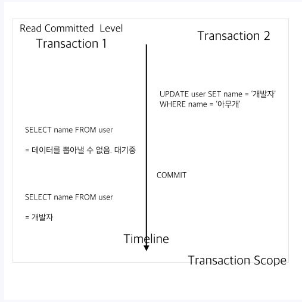

# 1. 자료구조

## 1-1. 자료구조의 구성

- Insert : 데이터를 어떻게 저장 할 것인가
- Search : 데이터를 어떻게 탐색 할 것인가
- Delete : 데이터를 어떻게 삭제 할 것인가

## 1-2. 자료구조의 분류

- 단순구조 : 프로그래밍에서 사용되는 기본 데이터 타입
- 선형구조 : 저장되는 자료의 전후관계가 1:1(리스트, 스택, 큐 등)
- 비선형구조 : 데이터 항목 사이의 관계가 1:n 또는 n:m (트리, 그래프 등)
- 파일구조 : 서로 관련된 필드들로 구성된 레코드의 집합인 파일에 대한 자료구조

# 2. DB

## 2-1. 트랜잭션 고립화 레벨(Transaction Isolation Level)

> Transaction : 데이터베이스의 상태를 변화시키기 위해 수행하는 작업의 단위
>
> 간단하게 SQL을 이용하여 데이터베이스를 접근하는 것을 의미

### 2-1-1) Isolation Level(고립화 레벨)의 필요성

- DB는 무결성을 보장하는 것이 중요하다

  - 무결성 : 데이터베이스에 값이 정확하다는 것을 의미한다

  그 무결성을 보장하기 위한 특징이 ACID(Atomicity, Consistency, Lsolation, Durability) 이다.

  - ACID(원자성, 일관성, 고립성, 지속성) : 데이터베이스 트랜잭션이 안전하게 수행된다는 것을 보장하기 위한 성질을 가리키는 약어

  DB는 ACID가 의미하는 바와 같이 Transaction이 원자적이면서도 독립적인 수행을 하도록 해야 한다. 그래서 등장하는 개념이 **Locking**이다.

- **Locking**은 Transaction이 DB를 다루는 동안 다른 Transaction이 관여하지 못하게 막는다.

  But 무조건적인 **Locking**으로 동시에 수행되는 많은 Transaction들을 일렬로 대기시킨다면 DB의 성능은 현저하게 떨어진다

- 반대로 **응답성**을 높이기 위해 **Locking범위**를 줄인다면 잘못된 값이 처리될 여지가 있다. 그래서 최대한 **효율적인 Locking 방법**이 필요하다.
- 이와 관련된 Locking방법이 **Isolation Level(고립화레벨)**이다.

### 2-1-2) Isolation Level(고립화 레벨)의 종류

> Exclusive lock(배타적 잠금)
>
> 쓰기잠금(Write lock)이라고도 불린다. 어떤 트랜잭션에서 데이터를 변경하고자 할 때 해당 트랜잭션이 완료될 때까지 해당 테이블 혹은 레코드(row)를 다른 트랜잭션에서 읽거나 쓰지 못하게 하기 위해 Exclusive lock을 걸고 트랜잭션을 진행시키는 것이다.
>
> Shared lock(공유 잠금)
>
> 읽기잠금(Read lock)이라고도 불린다. 어떤 트랜잭션에서 데이터를 읽고자 할 때 다른 shared lock은 허용이 되지만 exclusive lock은 불가하다. 쉽게 말해 리소스를 다른 사용자가 동시에 읽을 수 있게 하되 변경은 불가하게 하는 것이다.

#### 1) Read Uncommitted

- Select 문장을 수행하는 경우 **해당 데이터**에 **Shared Lock**이 걸리지 않는 Level이다.

- 따라서 어떤 사용자가 A -> B로 데이터를 변경하는 동안 다른 사용자는 **완료되지 않은(Uncommitted 혹은 Dirty Data)** B를 읽을 수 있다.

- 즉 Transaction이 끝나지 않은 상황에서 각기 **다른 Transaction**이 **변경한 내용**에 대한 **조회** 가 가능하다.

  그렇게 되면 **데이터베이스의 일관성**을 유지할 수 없다.

- Transaction1이 최초 수행되고 그 뒤에 Transaction2가 값을 변경할 경우

  다시 Transaction1이 조회를 하게 되면 Transaction2가 Commit은 하지 않았지만

  이미 Transaction2가 값을 변경하였기 때문에 아무개에서 개발자로 값이 변경되어 조회가 된다.

#### 2. Read committed

- **SQL Server**가 Default로 사용하는 Isolation Level이다.
- 이 Level에선 Select 문장이 수행되는 동안 **해당 데이터**에 **Shared Lock**이 걸린다.
- 그러므로 어떠한 사용자가 A-> B로 데이터를 변경하는 동안 다른 사용자는 해당 데이터에 접근할 수 없다.
- Read Uncommitted와 다르게 **Commit**이 이루어진 **데이터**가 **조회**된다.
- 하지만 어떠한 사용자가 A->B로 데이터를 변경하는 동안 다른 Transaction은 접근할 수 없어 **대기**하게 된다.

1. Transaction2가 Update를 하게된다.
2. 아직 Commit하지 않아 Transaction1은 Select를 하지 못하고 대기하게 된다.
3. Transaction2가 Commit명령어를 날리게 된다.
4. 이제 Transaction2는 조회가 가능하다.

#### 3. Repeatable(반복가능한) Read

- Transaction이 완료될 때까지 Select문장이 사용하는 모든 데이터에 **Shared Lock**이 걸리므로

  다른 사용자는 그 영역에 해당되는 데이터에 대한 수정이 불가능하다.

- 가령 Select col1 from A Where col1 between 1 and 10을 수행하였고 

  이 범위에 해당하는 데이터가 2건이 있는경우(col1 = 1, 5)

  다른 사용자가 col1 = 1 혹은 col1 = 5인 Row에 대한 Update 작업이 불가능 하다.

  하지만 col1이 1과 5를 제외한 **나머지 범위**에 해당하는 Row를 **Insert**하는 것은 가능하다.

- 그 결과 Transaction이 최초 수행된 후 해당 범위내에서는 **조회한 데이터**의 내용이 항상 **동일함**을 보장한다.

1. Transaction1이 Selcet 시점에 아무개가 조회된다.
2. Transaction2가 Update후 Commit을 시행하였지만 Update가 안된다. 그러나 Insert는 된다.
3. Transaction1이 다시 조회 해도 Transaction2가 Commit이 되지 않았기 때문에 아무개로 조회된다. 하지만 Insert한 동네개발자는 조회된다.
4. Transaction1이 종료되면 다시 Commit이 이루어지기 때문에 개발자로 조회가 된다.

