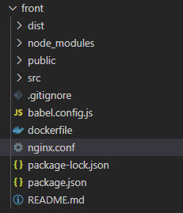
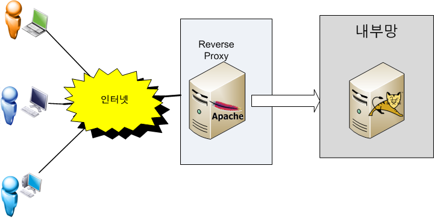

# 도커를 활용한 배포 기본편

## Step 1 docker, docker-compose 설치

### Ubuntu에 Docker 설치

```bash
$ curl -fsSL <https://get.docker.com/> | sudo sh # 도커 자동 설치 받고 | 설치
	$ sudo usermod -aG docker $USER # 현재 접속중인 사용자에게 권한주기
$ docker version # 도커 버전 확인하기 => 설치가 잘 되었다면 버전이 아래와 같이 잘 뜬다
Client: Docker Engine - Community
 Version:           19.03.9
 API version:       1.40
 Go version:        go1.13.10
 Git commit:        9d988398e7
 Built:             Fri May 15 00:25:18 2020
 OS/Arch:           linux/amd64
 Experimental:      false
............
```

### Ubuntu에 Docker-Compose 설치

먼저 https://github.com/docker/compose/releases 에서 컴포즈 버전을 확인한다.

다음으로 아래와 같은 명령어를 넣는다!

```bash
$ sudo curl -L <https://github.com/docker/compose/releases/download/>[컴포즈 버전]/docker-compose-$(uname -s)-$(uname -m) -o /usr/local/bin/docker-compose # 컴포즈 설치파일 다운로드
$ sudo chmod +x /usr/local/bin/docker-compose # 도커 컴포즈에 권한 부여
$ docker-compose --version # 도커 컴포즈 버전 확인 => 잘 되었으면 뜬다
```

## Step 2 Frontend(nginx + vue)


- nginx을 왜 쓰냐? 
  - 우리가 개발한 응용 프로그램이 OSI 7 Layer 중 application Level에서 동작하고 그 아래 Level에서 NGINX 같은 웹 서버가 HTTP 통신을 제공하게 된다.
  - NGINX는 Event-Driven 방식으로 동작한다. 한 개 또는 고정된 프로세스만 생성 하고, 그 프로세스 내부에서 비 동기 방식으로 효율적으로 작업들을 처리한다. 따라서 동시 접속 요청이 많아도 Process 또는 Thread 생성 비용이 존재하지 않는다.



파일 구조

### dockerfile 작성

- 다단계 빌드가 진행된다.
- 첫 번째 단계는 Vue.js 앱을 빌드한다.
- 두 번째 단계는 만들어진 앱을 NGINX를 사용하여 동작하게 한다.

```docker
# build stage(vue.js 빌드)
FROM node:lts-alpine as build-stage # 노드 설치 및 사용
WORKDIR /app # 도커내 작업폴더 지정
COPY package*.json ./ # 도커내 작업폴더에 노드 환경(package.json ...)을 복사
RUN npm install # 노드 환경 설치
RUN npm install @vue/cli@3.7.0 -g
COPY . .
RUN npm run build # vue 빌드

# production stage(nginx 사용하여 동작)
FROM nginx:stable-alpine as production-stage # nginx 설치 및 사용
COPY --from=build-stage /app/dist /usr/share/nginx/html # 빌드된 내용을 nginx에 올리기
RUN rm /etc/nginx/conf.d/default.conf # 도커내 nginx 환경변수 제거(내맘대로 조작하려구)
COPY nginx.conf /etc/nginx/conf.d # 도커내 nginx 환경변수 복사
EXPOSE 80 # 80번 포트로 외부에 노출
CMD ["nginx", "-g", "daemon off;"] # nginx 실행
```

nginx의 설정변수는 다음과 같다.

만약 안하면 주소를 url에 입력했을 때 Nginx에서 주소를 찾지 못해 404 Not Found 지옥을 맛 볼 수 있다.

```nginx
# nginx.conf
# 리버스 프록시 설정이 안 들어감
# SSL 아직 구현 안함
server {

  listen 80;

  location / {
    root   /usr/share/nginx/html;
    index  index.html index.htm;
    try_files $uri $uri/ /index.html;
  }

  error_page   500 502 503 504  /50x.html;

}
```

## Step 3 Backend(Spring BOOT + 내장 Tomcat + MYSQL) - gradle 기준

### 도커파일(다단계 배포)

```docker
# build stage (gradle build)
FROM openjdk:8-jdk-alpine as builder # 빌드를 위해 자바 가져오기
COPY gradlew .
COPY gradle gradle
COPY build.gradle .
COPY settings.gradle .
COPY src src
RUN chmod +x ./gradlew
RUN ./gradlew bootJar # jar파일을 생성

# production stage 내부 tomcat 이용 실행
FROM openjdk:8-jdk-alpine
RUN addgroup -S spring && adduser -S spring -G spring 
USER spring:spring 
COPY build/libs/*.jar app.jar
EXPOSE 8197 # 포트 번호
ENTRYPOINT ["java","-jar","/app.jar"] # jar파일을 실행해 버림!
```


### 빌드 전 확인사항

두개의 파일 체크하자!

```java
## application.properties

spring.datasource.driver-class-name=com.mysql.cj.jdbc.Driver
spring.datasource.url=jdbc:mysql://[ubuntu ip]:[db port Number]/[db table Name]?useUniCode=yes&characterEncoding=UTF-8&serverTimezone=Asia/Seoul
spring.datasource.username=root
spring.datasource.password=[루트 비밀번호]

mybatis.config-location=classpath:mybatis-config.xml
logging.level.root=WARN
logging.level.com.ssafy.edu.mapper=TRACE

## application.yml
server:
  port: [배포 port Num]
```

두 파일이 db와 외부 ip와 관련있는 부분이다.

체크 안할시 db와 spring boot이 연결되지 않아 지옥을 맛 볼 수 있다.

빌드가 안되는 경우 ubuntu에 mysql이 없어서 배포가 안되는 경우가 있다.

## Step4 docker-compose작성

```yaml
version: '3'                         # 컴포즈 버전
services:
  front:                             # 서비스 이름
    build: "./front"                 # 폴더 위치
    ports:
      - "80:80"                      # 포트 설정

  db: #
    restart: always                  # 서버 재실행
    image: mysql                     # 도커파일 이미지 이름지정
    environment:                     # 환경변수
      MYSQL_DATABASE: sangle
      MYSQL_ROOT_HOST: '%'
      MYSQL_ROOT_PASSWORD: ssafy
    command:                         # db 설정과 관련된 명령
      --default-authentication-plugin=mysql_native_password # 기본 authentication plugin 설정
      --character-set-server=utf8mb4 # utf8 한글 깨짐 관련
      --collation-server=utf8mb4_unicode_ci # 한글 깨짐 관련
    ports:                           # 포트 설정
      - 3306:3306
  
  back:                              # 서비스이름
    build: './backend'               # 폴더 위치
    expose:                          # 노출시킬 포트
      - "8197"
    ports:                           # 포트 설정
      - 8197:8197
    environment:                     # mysql이 될때 까지 기다리란 환경변후
      WAIT_HOSTS: mysql:3306        
    depends_on:                      # db 서비스와 연관 시키겠다!
      - db
```

도커 컴포즈를 다음과 같이 작성한다!

```bash
docker-compose up -d --build
```

이러고 명령 실행하면 끝!!!

## 리버스 프록시

nginx.conf파일을 다시 보면 다음과 같이 구성되어있다.

```nginx
server {
  listen 80;
  location / {
    root   /usr/share/nginx/html;
    index  index.html index.htm;
    try_files $uri $uri/ /index.html;
  }
  error_page   500 502 503 504  /50x.html;
}
```

파일에서 볼 수 있 듯 그냥 프론트엔드만 구성되어 배포되고 백엔드는 80번 포트가 아니라 다른 포트로 접근해야 할 수 있다. => 이럼 웹서버 왜쓰냐..

그러기에 80번 포트에 들어온 요청에 대해 일부는 백엔드로 보내고 나머지는 프론트에서 처리 할 수 있도록 하는것이 좋다!

먼저 포워트 프록시(Forward Proxy)와 리버스 프록시(Reverse Proxy)의 개념에 대해 알아보자

### 포워트 프록시

클라이언트가  example.com 에 연결하려고 하면 사용자 PC 가 직접 연결하는게 아니라 포워드 프록시 서버가 요청을 받아서  example.com 에 연결하여 그 결과를 클라이언트에 전달(forward) 해 준다.


포워드 프록시는 대개 캐시 기능이 있으므로 자주 사용되는 컨텐츠라면 월등한 성능 향상을 가져온다고 하며... 정해진 사이트만 연결하게 설정하는 등 웹 사용 환경을 제한할수 있으므로 기업 환경등에서 많이 사용한다고 한다.


### 리버스 프록시

클라이언트가 example.com 웹 서비스에 데이타를 요청하면 Reverse Proxy는 이 요청을 받아서 내부 서버에서 데이타를 받은후에 이 데이타를 클라이언트에 전달하게 된다.

  

내부 서버가 직접 서비스를 제공해도 되지만 이렇게 구성하는 이유중 하나는 보안때문이다.

보통 기업의 네트워크 환경은 DMZ 라고 하는 내부 네트워크와 외부 네트워크 사이에 위치하는 구간이 존재하며 이 구간에는 메일 서버, 웹 서버, FTP 서버등 외부 서비스를 제공하는 서버가 위치하게 된다.

example.com 사는 서비스를 자바로 구현해서 WAS 를 DMZ 에 놓고 서비스해도 되지만 WAS 는 보통 DB 서버와 연결되므로 WAS 가 최전방에 있으면 WAS 가 털릴 경우 DB 서버까지 같이 털리는 심각한 문제가 발생할 수 있다.

이때문에 리버스 프락시 서버를 두고 실제 서비스 서버는 내부망에 위치시키고 프락시 서버만 내부에 있는 서비스 서버와 통신해서 결과를 클라이언트에게 제공하는 방식으로 서비스를 하게 된다.

특히 리눅스 환경이라면 리버스 프락시로 아파치 웹 서버를 사용한다면 SELinux 를 켜 놓으면 SELinux 의 기본 정책이 웹 서버는 톰캣의 8080, 8009 포트만 접근 할 수 있으므로 아파치 웹 서버가 해킹당해도 웹 서버 권한으로는 내부망으로 연결이 불가하다.

리버시 프락시를 cluster로 구성해 놓으면 가용성을 높일 수 있고 사용자가 증가하는 상황에 맞게 Web Server 나 WAS 를 유연하게 늘릴 수 있는 장점이 있다.

 ### 그래서 어케 적용함?

> 요렇게~

```nginx
server {
    listen 80 default;
    listen [::]:80 default;
    location / {
        root   /build/FrontEnd/build;
        index  index.html index.htm;
        try_files $uri $uri/ /index.html;
    }
    location /api {
        proxy_pass http://localhost:8080/api;
        proxy_redirect off;
        charset utf-8;
        proxy_set_header Host              $host;
        proxy_set_header X-Real-IP         $remote_addr;
        proxy_set_header X-Forwarded-For   $proxy_add_x_forwarded_for;
        proxy_set_header X-Forwarded-Proto $scheme;
    }
    error_page   500 502 503 504  /50x.html;
}
```

