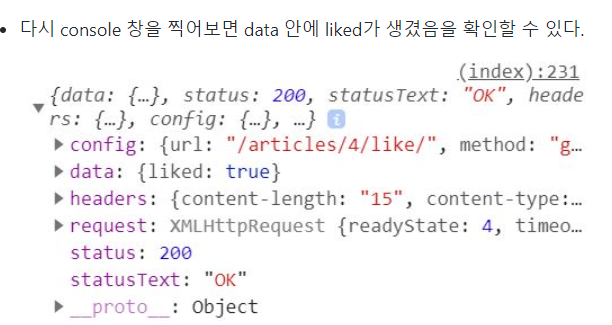
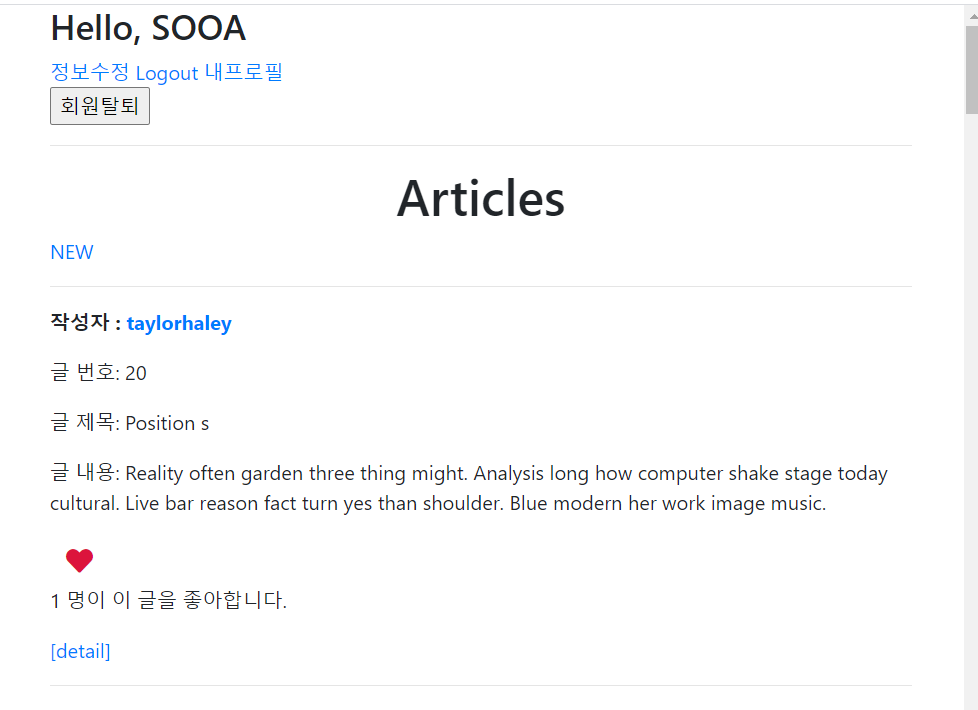

# JavaScript

## Like

> Like 기능 비동기적으로 구현(axios 적용)
>
> 1. like 버튼을 누르면
> 2. js가 요청을 한다 -> article id, header-csrf token
> 3. 요청을 받는 것은 django의 like 부서이다
> 4. like 부서는 좋아요를 처리(db에다가 그렇게 쓴다) 응답으로 지금 요청을 한애가 좋아하는지 여부, 이 글을 좋아하는 사람 수 두 가지 정보를 줌
> 5. js는 응답을 받아서
> 6. 좋아요 버튼 색깔과 사람 수 숫자를 바꿈

1. `base.html` > `head 태그`

- `axios CDN` 추가, 다른 html에서 JavaScript 코드를 쓸 `block script`를 만듦

```
<!-- axios CDN을 가져옴! -->
  <script src="https://cdn.jsdelivr.net/npm/axios/dist/axios.min.js"></script>
  
  
```

1. `articles `> `index.html` > `like form`

- 자바스크립트로 요청을 보내므로 필요 없으므로 a 태그, method 삭제

- 어떠한 article에 대한 버튼인지 하트에 정보를 더 추가해야함

- 이 form은 여러 articles에 적용되고, id값으로 줬을때 pk를 다 달리줘야되고 다른 id랑 겹치는 경우가 생길 수도 있으니 `class` 부여

  - 여기서 id값으로 줬을 때 일어날 수 있는 문제?
  - id는 하나여야 되는데 articles는 여러개! 권장하지 않음
  - 그리고 id값이 article 1,2,3,,, 이렇게 순서대로 pk가 이어지지도 않음! 그래서 그런것을 고려하기보다 class로 한번에 처리하는게 좋다!

- `like-form` 클래스 속성(자바스크립트에서 클래스를 찾기 위한 용도)

  - 자바스크립트는 `data-id`를 통해 개별적인 오브젝트에 접근 가능
  - `data-id` 는 [HTMLElement.dataset](https://developer.mozilla.org/ko/docs/Web/API/HTMLElement/dataset) 속성을 활용한 것으로 HTML 이나 DOM 요소의 커스텀 데이터 속성(`data-*`)에 대한 읽기와 쓰기 접근을 허용시킴.

- 어떤 게시글의 좋아요인지 알기 위해 `index.html`에 `data-article-id` 속성을 추가한다.

- **`data-id`를 통해 각 객체에 접근할 수 있다.**

  - ```
    dataset
    ```

     

    을 통해 개별적인 객체에 접근이 가능하다.

    - 콘솔창에서 id가 새로 생성됨을 확인할 수 있다.

  ```
  dataset: DOMStringMap {id: "4"}
  ```

- 구별할 수 있는 `article.pk`를 빌려와 사용한다.

```
<form class="d-inline like-form" data-article-id='{{article.pk}}'>
```

1. `articles` > `index.html` > ``

```

<script>
    //#1.
    const forms = document.querySelectorAll('.like-form')
    
    //#2.
    const csrfTokenInput = document.querySelector('input[name="csrfmiddlewaretoken"]')
    const csrftoken = csrfTokenInput.value
    
    //#3.
    forms.forEach(form => {
      form.addEventListener('submit',(event)=>{
        
        //#4.
        event.preventDefault()
             
        //#5.
        // event.target.dataset.articleId
        const articleId = form.dataset.articleId
 
        //#6.
        axios.post(`/articles/${articleId}/like/`,
          {},
          {headers: {'X-CSRFToken': csrftoken}}
          ).then((response)=>{
            
            //#7.
              if (response.data.error === 'unauthorized') {
                window.location.href = '/acccount/login/'
              }
              //#8.
              const likeBtn = document.querySelector(`#like-btn-${articleId}`)
              const likeCount = document.querySelector(`#like-count-${articleId}`)
              // // 좋아요 색 지정
              // 1. if로 쓰는 법
              // if (response.data.liked) {
              //   likeBtn.style.color = 'crimson'
              // } else {
              //   likeBtn.style.color = 'black'
              // }
              // 2. 삼항연산자로 쓰는 법
              likeBtn.style.color = response.data.liked ? 'crimson' : 'black'
              // 응답이 왔을 때 좋아요 표시
              likeCount.innerText = response.data.count
          })
      })
    })
</script>

```

**#1.각 게시글별로 좋아요 버튼이 있으니 모두 선택해야 한다.**

- 폼이 한개만 있는 것이 아니므로 (각 article 별로 좋아요 폼이 있음)
- 모든 폼을 다 가지고 와야함.

**#2. csrftoken**

- csrftoken가져옴
- input type이 hidden인 것은 나중에 같은 것이 나올수도 있지만 name이 csrftoken인 것은 이거밖에 없을 것같다!
- name 값으로 데이터를 가져오자!
- input의 name속성은 이렇게 가져옴`'input[name="csrfmiddlewaretoken"]'`

**#3. 각 폼에 event적용**

- `forEach` -> 인자로 각 요소인 `form`이 들어감!
- `document.querySelectorAll` 을 이용하여 모든 데이터를 가져오며, 반복문(`forEach`)을 통해 개별적인 폼에 대한 `addEventListentListener` 구현.
- 이때 `querySelectorAll`의 인자로 form 태그 클래스 내에서 정의한 클래스명인 `like-form`를 사용

**#4. form의 기본 속성 제거**

- forms의 각각 form에다가 기본 submit 동작이 발생하지 않게 막아야한다
- `preventDefault()`는 form(`event`)의 원래 기본 동작을 막아줌!

**#5. article.id 값 가져오기**

- `event` 오브젝트 객체 안, 정확히는 `event.target.dataset.id`의 value에는 `data-article-id`의 값인 `{{article.id}}`이 저장되어있으며, 이를 좋아요 기능에 대한 url 주소를 불러올 `variable routing값`으로 쓰임.
- html의 `-`는 js에서 지원되지 않아서 `article-id`->`articleId` 이렇게 바뀜
- `event.target === form`이랑 같은거기 때문에 `form.dataset.id` 적어도됨!
- urlpattern에 따라 좋아요의 url 주소는 `<int:article_id>/like/` 와 같이 정의 되어 있으며, 이 주소를 `axios.post`의 인자로 넘김.

**#6. axios**

> ```
> axios.post(url[, data[, config]])
> ```
>
> `index.html` - `post` 방식으로 보내기
>
> `axios.get(~)`을 `axios.post(~)`로 바꾸면 403 error(forbidden)가 발생한다.
>
> ```
> // before
> axios.get(`/articles/${articleId}/like/`) 
> 
> // after
> axios.post(`/articles/${articleId}/like/`) 
> ```

- 첫번째 인자로 요청을 보낼 `like`의 url 주소를 적음
  - `` 이거 써도 되지만 이거말고 다르게 표현!
- 두번째 data는 빈 객체`{}`를 보냄, 필수인자이기 때문에 빈객체라도 보내야됨
- 세번째 인자는 POST요청시 필요한 `csrftoken`을 같이 보내줌!
- submit할 때 like 에다가 요청 보내서 응답오면 `.then`의 괄호안에 일을 수행!
- 요청에 대한 응답(`.then` 메서드)으로, response 객체의 반환 값으로 views.py를 통해 redirect된 list.html 전체가 반환됨
- 우리는 “좋아요” 기능만 구현하면 되므로, HTML 문서 전체를 반환할 필요가 없음.
- 이는 불필요한 응답이므로 views.py 수정이 필요함

**#7. 로그인페이지로 redirect**

- js에서 redirect! 로그인페이지로 보냄!
- 좋아요를 눌렀을 때 인증된 유저가 아니라면 로그인 페이지로 가게 만듦

1. `articles` > `views.py`

```
from django.http import JsonResponse

@require_POST
def like(request, article_pk):    
    #1.
    context = {
        'error':'unauthorized'
    }
    if request.user.is_authenticated:
        article = get_object_or_404(Article, pk=article_pk)
        user = request.user
        if article.like_users.filter(pk=user.pk).exists():
        # if user in article.like_users.all():
            article.like_users.remove(user)
            #2.
            liked = False
        else:
            article.like_users.add(user)
        	#2.
            liked = True
        #1.
        context = {
            'liked':liked,
            'count':article.like_users.count(),
        }
        # return redirect('articles:index')
	#3.
    return JsonResponse(context)
    # 브라우저 요청을 했을 때 redirect가 되는거지 JavaScript에서는 아무소용없기 때문에 필요없는 코드
    # return redirect('accounts:login')
```

**#1. context**

- context가 if문을 안들어갔을 경우 아무것도 안담겨 있으니 error를 담아서 넘겨줌
- if문안에 들어갔다면 user가 `liked` `True/False`를 같이 보내줌
- `count`이 유저를 좋아하는 수를 count한걸 값으로 보내줌!
- 여기서 유저를 좋아하는 수는 article의 `like_users`필드를 통해 가져옴

**#2. liked**

- JSON 데이터에 liked 변수를 만들어서 template 에서 좋아요를 취소할지 추가할지를 판단할 수 있도록 한다.
- liked 변수는 False로, 반대의 경우(좋아요를 누르는 경우)는 liked 변수에 True 값
- 그래서 True False 값을 통해 좋아요 버튼의 style 값(여기서는 좋아요 버튼의 색깔)을 변경한다.

**#3. Json**

- 기존 redirect 로 인해 `index.html` 로 페이지가 로딩되는 것이 아닌 JSON 형태로 응답결과를 반환 받기로 변경한다.
- 전체 html파일을 가져오는 것이 아니라 기능별로 정보만 가져올 것이기 때문에 json형태로 응답결과를 가져옴
- 모듈을 불러옴 `from django.http import JsonResponse`

[](https://github.com/irissooa/irissooa-TIL/blob/master/web/1015_JavaScript_like_follow.assets/image-20201014222049560.png)

1. 좋아요 색 변경

- `articles` > `index.html`

> 좋아요 버튼 누를 때마다 버튼의 색깔만 바뀌고 좋아요 개수는 아직 변하지 않는다.

```

<script>
    //(생략)
        //#6.
        axios.post(`/articles/${articleId}/like/`,
          {},
          {headers: {'X-CSRFToken': csrftoken}}
          ).then((response)=>{
            
            //#7.
              if (response.data.error === 'unauthorized') {
                window.location.href = '/acccount/login/'
              }
            
               //#8-1.
              const likeBtn = document.querySelector(`#like-btn-${articleId}`)
              
              //#9.
              const likeCount = document.querySelector(`#like-count-${articleId}`)
              
              //#8-2. 좋아요 색 지정
              likeBtn.style.color = response.data.liked ? 'crimson' : 'black'
              //#9. 응답이 왔을 때 좋아요 표시
              likeCount.innerText = response.data.count
          })
      })
    })
</script>

```

**#8.**

- 응답오면 좋아요 표시
- `event` > `target` > `style` > `color`에 색깔 정보가 있다.

```
      
        <button class="btn btn-link">
          <i id='like-btn-{{article.pk}}' class="fas fa-heart fa-lg" style="color:crimson;"></i>
        </button>
      
        <button class="btn btn-link">
          <i id='like-btn-{{article.pk}}' class="fas fa-heart fa-lg" style="color:black;"></i>
        </button>
      
```

- 좋아요 버튼에 id 기반으로 색을 어떻게 바꿀지 정하려고 id값을 지정해줌
- `script`에서 id(`#`)로 버튼을 불러옴

**#8-2 좋아요 색 지정**

```
//1. if로 쓰는 법
if (response.data.liked) {
   likeBtn.style.color = 'crimson'
 } else {
   likeBtn.style.color = 'black'
 }

//2.삼항연산자로 쓰는 법
likeBtn.style.color = response.data.liked ? 'crimson' : 'black'
```

1. 좋아요 개수도 함께 출력

**#9. 좋아요 개수 **

- `like` view 함수의 `context` 안에 `'count': article.like_users.count(),` 추가
- `index.html`

> span 태그로 숫자 부분만 감싸고 id 속성을 추가한다.
>
> 각각이 다른 id 값을 가져야 하므로 id 작성시 article.pk 이용

```
<!-- before -->
<b>{{ article.like_users.all|length }}</b>명이 이 글을 좋아합니다. 

<!-- after -->
<b><span id="like-count-{{ article.pk }}">{{ article.like_users.all|length }}</span></b>명이 이 글을 좋아합니다. 
```

[추가]

1. 요청이 ajax 요청일 때만 받아들이게 하기

```
# views.py

from django.http import JsonResponse, HttpResponseBadRequest

@login_required
def like(request, article_pk):
    if request.is_ajax(): # if문으로 분기
        article = get_object_or_404(Article, pk=article_pk)
        if article.like_users.filter(pk=request.user.pk).exists():
            article.like_users.remove(request.user)
            liked = False
        else:
            article.like_users.add(request.user)
            liked = True
        context = {'liked': liked, 'count': article.like_users.count(),}
        return JsonResponse(context)
    else:
        return HttpResponseBadRequest()
```

- 하지만 현재 상황은 django가 ajax 요청인지 아직 모른다.
- django측에 ajax 요청임을 알려줘야 한다.
- axios 공식 문서의 `Request Config`에서 `headers: {'X-Requested-With': 'XMLHttpRequest'},` 구문을 찾아 `index.html`에 붙여넣어야 한다. [(공식 문서)](https://github.com/axios/axios#request-config)
- 추가로 `.headers.common`도 붙여줘야 한다. [(공식 문서)](https://github.com/axios/axios#global-axios-defaults)

```
const articleId = event.target.dataset.id

// ajax 요청임을 알려주는 구문 (이거 추가)
axios.defaults.headers.common['X-Requested-With'] = 'XMLHttpRequest' 

// POST 요청임을 알려주는 구문1 (이거 추가)
axios.defaults.xsrfCookieName = 'csrftoken' 

// POST 요청임을 알려주는 구문2 (이거 추가)
axios.defaults.xsrfHeaderName = 'X-CSRFToken' 
axios.post(`/articles/${articleId}/like/`)
...
```

[](https://github.com/irissooa/irissooa-TIL/blob/master/web/1015_JavaScript_like_follow.assets/image-20201014201217613.png)

------

## Follow

> 1. 팔로우 버튼을 누르면
> 2. js가 요청을 한다(header-csrf토큰, url-user-id가 필요하다)
> 3. 요청을 받는 데는 django follow부서이다
> 4. follow 부서는 follow 로직 -> 팔로우를 내가 하는지? 팔로워 수를 반환해야됨
> 5. js는 응답을 받아서
> 6. 팔로우 버튼과 사람수 숫자를 바꿈

1. `accounts` > `profile.html`

```
<!--#1.-->

  <script>
	//#2.
    const followForm = document.querySelector('#follow-form')
    
    //#3.
    followForm.addEventListener('submit', (event)=>{
      event.preventDefault()
      const userId = followForm.dataset.userId
      const csrfTokenInput = document.querySelector('input[name="csrfmiddlewaretoken"]')
      const csrftoken = csrfTokenInput.value
    
      axios.post(`/accounts/follow/${userId}/`,{},{headers: {'X-CSRFToken': csrftoken}}).then(((response)=>{
          
        //#4.
        const followBtn = document.querySelector(`#follow-btn-${userId}`)
        
        //#5.
        const followCount = document.querySelector(`#follow-count-${userId}`)
        
        //#4-2. class를 바꾸기
        followBtn.className = response.data.followed ? 'btn-secondary btn-lg' : 'btn-primary btn-lg'  
        // if (response.data.followed) {
        //   followBtn.classList.replace('btn-primary','btn-secondary')
        //   followBtn.innerText = 'Unfollow'
        // }else{
        //   followBtn.classList.replace('btn-secondary','btn-primary')
        //   followBtn.innerText = 'Follow'         
        // }
        // followBtn.classList.toggle('btn-primary')
        // followBtn.classList.toggle('btn-secondary')
        followBtn.innerText = response.data.followed ? 'Unfollow' : 'Follow'  
        followCount.innerText = response.data.count
        
      }))
    })
    
  </script>


```

**#1. block script**

- block script를 base를 만들어줘서 각 html파일에 필요한 것을 block script안에 적d어서 계속 호출되는 것을 방지함
- 그리고 `_follow.html`보다 `profile.html` block script하는게 좋은 이유는 html코드가 모두 끝난 뒤에 script를 적어주는 게 오류가 안나기 때문!

**#2. follow폼**

```
<!--_follow.html-->

<form id = 'follow-form' data-user-id='{{person.pk}}'>  
```

- follow에 id로 js에서 다룰수 있게 만드려고 a태그, 메소드 지움
- 여기서 상대방(`person`)의 pk가 필요함

**#3. follow폼 submit event**

- `person.pk`를 `userID`로 가져오고 `csrftoken`도 가져옴(`like와 유사`)
- form의 기본 event도 `preventDefault()`로 제거
- post요청을 follow url로 csrf토큰과 함께 보내는데
- 요청에 대한 응답(`.then` 메서드)으로, response 객체의 반환 값으로 views.py를 통해 redirect

**#4,#5. follow 버튼 & folllower 수**

```
<!--_follow.html-->


	<button id='follow-btn-{{person.pk}}' class="btn-secondary btn-lg" role="button">Unfollow</button>

	<button id='follow-btn-{{person.pk}}' class="btn-primary btn-lg" role="button">Follow</button>

```

- follow버튼은 하나밖에 없으니 id값으로 `follow-btn-{{person.pk}}`를 줘서 js에서 다룰 수 있게 함

**#4-2 class 바꾸기**

- 

```
//#4-2. class를 바꾸기
//1. 삼항연산자로 쓰기
followBtn.className = response.data.followed ? 'btn-secondary btn-lg' : 'btn-primary btn-lg'  

//2. if문
if (response.data.followed) {
    followBtn.classList.replace('btn-primary','btn-secondary')
    followBtn.innerText = 'Unfollow'
}else{
    followBtn.classList.replace('btn-secondary','btn-primary')
    followBtn.innerText = 'Follow'         
}
//3. toggle이용
followBtn.classList.toggle('btn-primary')
followBtn.classList.toggle('btn-secondary')

//#5-2 follow 버튼 내용 바꾸기
followBtn.innerText = response.data.followed ? 'Unfollow' : 'Follow' 		//#count를 적기 
        followCount.innerText = response.data.count
        
      }))
    })
```